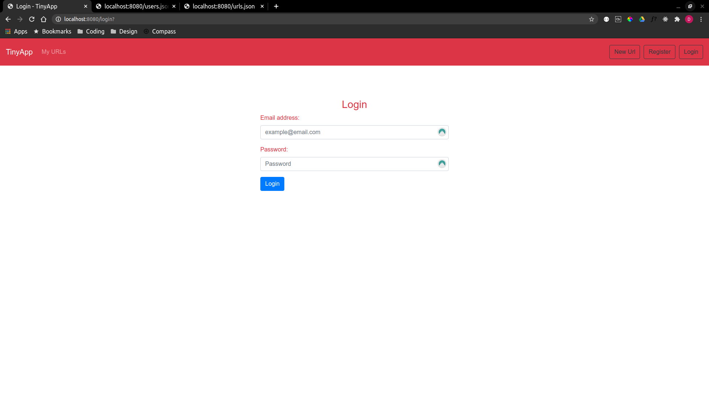
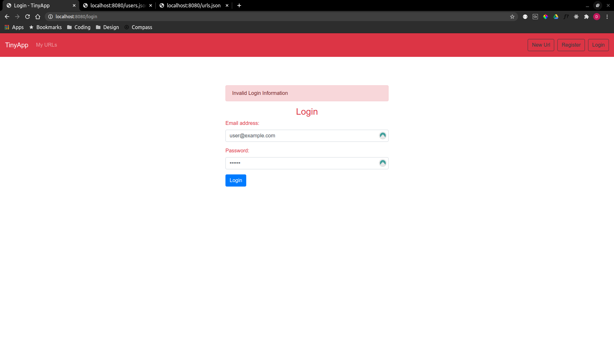
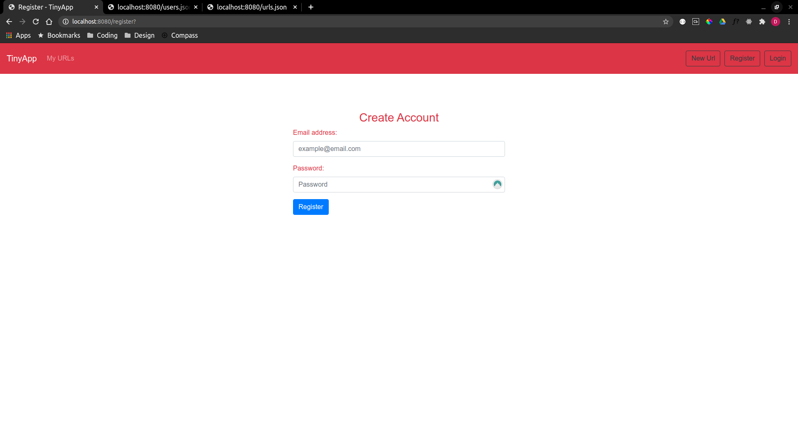
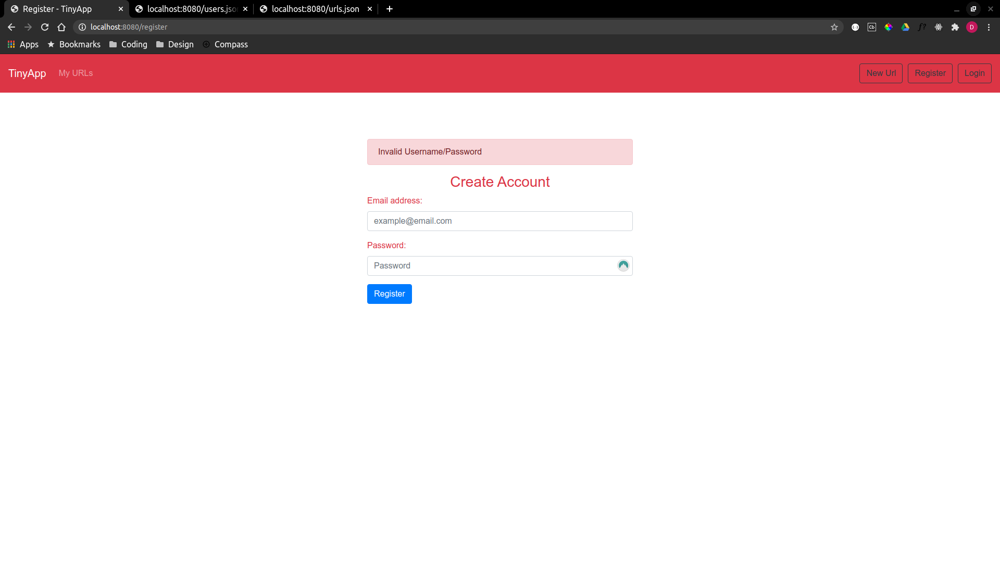
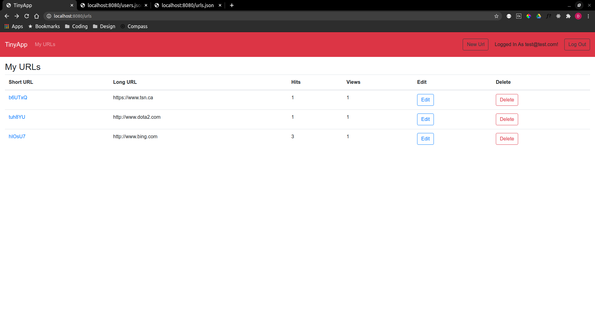
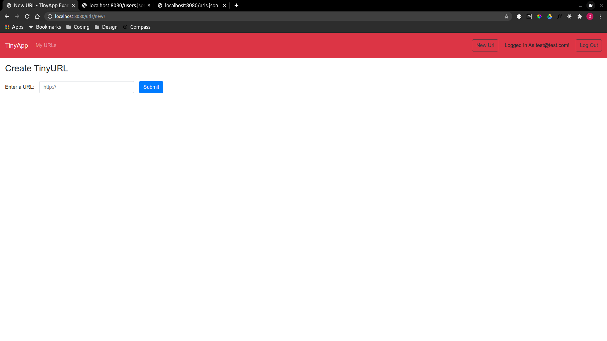
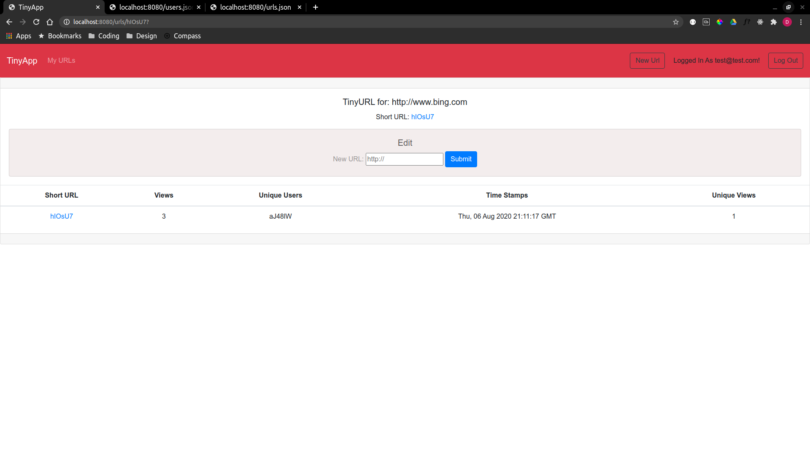
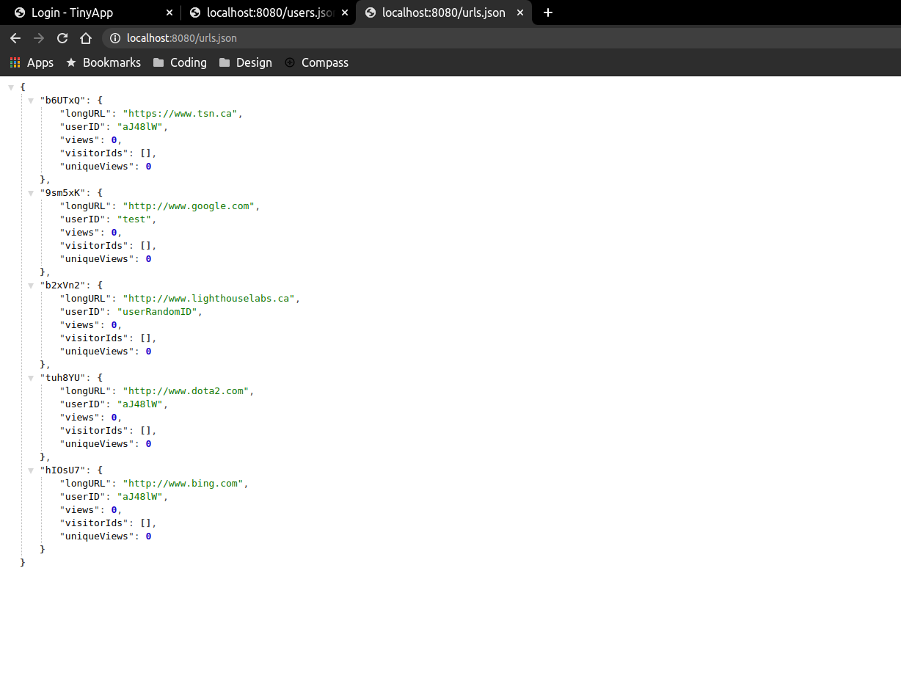
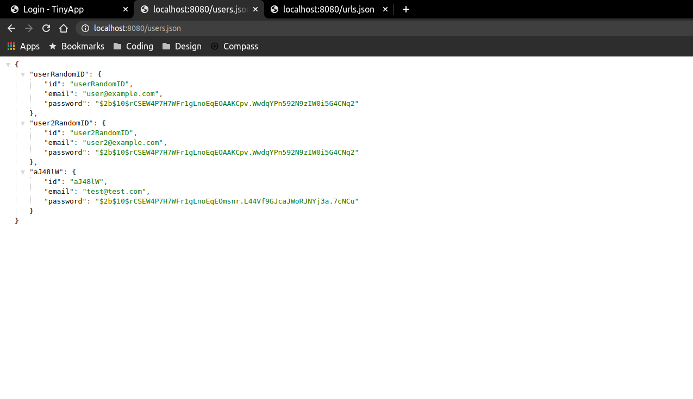

# TinyApp Project

TinyApp is a full stack web application built with Node and Express that allows users to shorten long URLs (à la bit.ly)

## Final Product

### Main Login Page

- If users are not logged in when you go to the site you are automatically redirected to the login page

### Login Page With Error

- If user enters an incorrect email address or password not on file an error will pop up with a message asking for correct credentials.

### Register New User Page

- Shows Registration page where you can create a new User

### Register Page With Error

- If user enters an email that is already on the database it returns and error message

### Main Urls Index Page

- Users home page which displays the username (email) of the user in the top right of the header
- Previously created shortURLs are linked to their longURL counterpart
- Some basic information is shown such as Hits which counts how many times anyone has clicked on the shortURL, Views is the amount of Unique Users who have clicked on the shortURL
- Edit brings you to the Update Page
- Delete, deletes the corresponding row of information from the database

### Create New Url Page

- When longURL is entered into the input and submitted it is checked to see if it has the pre-append http://, if not it is added and if it is present it is left the way it was input

### Url Show Page / Analytics

- Main Url edit/update page
- Table of analytics added as stretch goal
- Views denotes how many times the ShortURL has been clicked
- Unique Users displays the user id's of each unique user that has clicked the ShortURL
- Time Stamps are correspondent to the Unique Users and when they first clicked the shortURL.
- Unique Views is how many times a unique user have viewed the shortURL site

#### Basic Route To URL DB

#### Basic Route To USERS DB

## Dependencies

- Node.js
- Express
- EJS
- bcrypt
- body-parser
- cookie-session
- nodemon
- mocha & chai
- morgan
- method-override

## Getting Started

- Install all dependencies (using the `npm install` command).
- Run the development web server using the `node express_server.js` command
